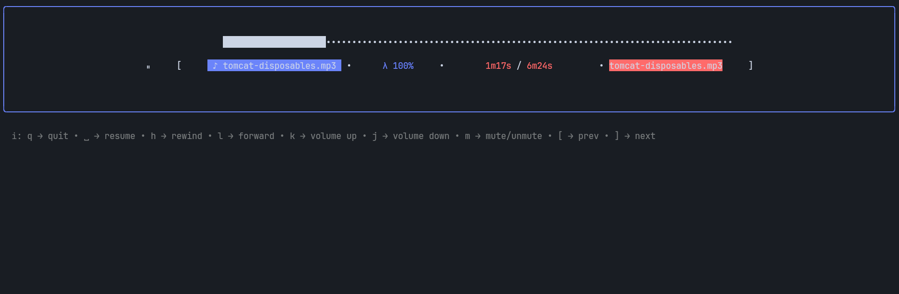
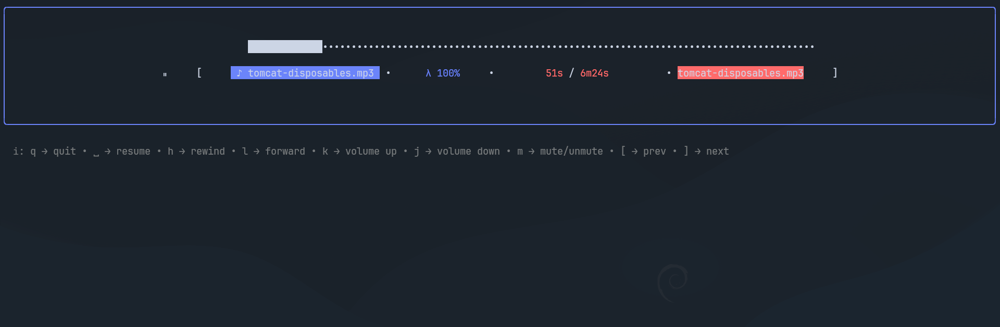

# Tempo

A simple TUI music player written in Go.




## Requirements

- Go 1.26+
- CGO enabled
- [alsa-lib](https://github.com/alsa-project/alsa-lib)

### Installing alsa-lib

#### Debian / Ubuntu

```sh
sudo apt install libasound2-dev
```

#### Fedora

```sh
sudo dnf install alsa-lib-devel
```

#### Arch

```sh
sudo pacman -S alsa-lib
```

## Building

Clone the repository and build the project using make:

```sh
git clone https://github.com/nicolito128/tempo.git
cd tempo
make
```

The compiled binary will be placed inside the `_output/bin/{OS}/{ARCH}` directory based on your operating system and architecture.

To install the binary system-wide (copies to /usr/local/bin/), run:

```sh
sudo make install
```

## Usage

You can run the player by providing a path to an audio file or a directory containing audio files:

```sh
tempo /path/to/your/music
```

Alternatively, you can run it directly from the source code using make:

```sh
make run ARGS="/path/to/your/music"
```
